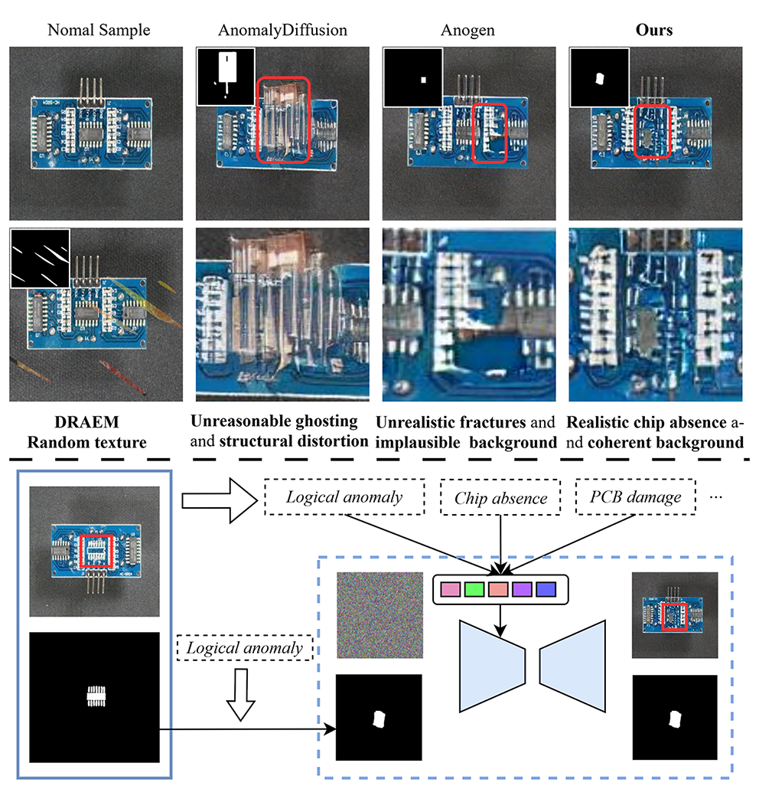
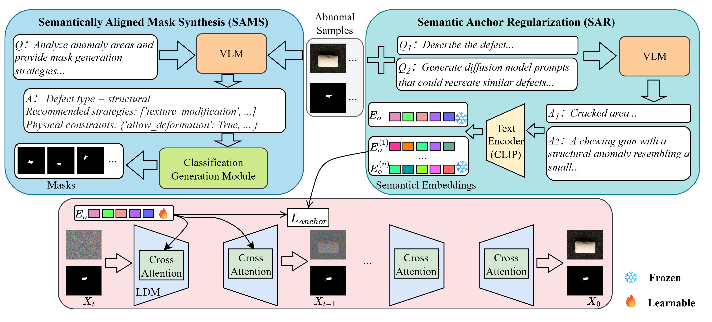
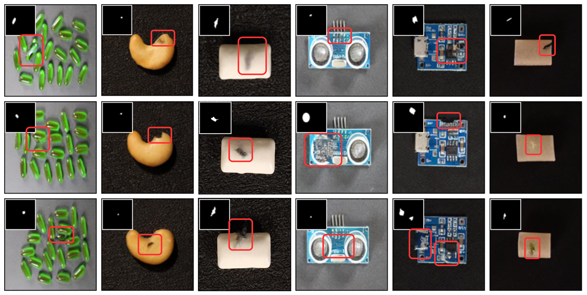

# VL-AnoDiff: Vision-Language Guided Diffusion for Few-Shot Industrial Anomaly Synthesis

**Mo Li**, **Shubo Zhou**, **Weiyu Hu**, **Xue-Qin Jiang**, **Yongbin Gao**

Donghua University · Shanghai University of Engineering Science

[](https://doi.org/10.1109/icassp55912.2026.11461878)
[](#license)

---

## Abstract

Acquiring large-scale annotated defect data is costly in industrial inspection. **VL-AnoDiff** is a vision-language guided diffusion framework for **few-shot industrial anomaly synthesis**. From only a few anomalous image–mask pairs, it produces realistic, diverse, and semantically controllable synthetic anomalies for downstream detection and classification.

Built on the [AnoGen](https://github.com/csgaobb/AnoGen) (ECCV 2024) diffusion baseline, VL-AnoDiff introduces:

- **Semantic Anchor Regularization (SAR)** — aligns learnable text-inversion embeddings with VLM-derived semantic anchors
- **Semantically Aligned Mask Synthesis (SAMS)** — generates spatially meaningful masks without manual bounding boxes

<p align="center">
  
  <br>
  <em>Figure 1. Compared with AnoDiff and AnoGen, VL-AnoDiff produces more realistic anomalies with coherent backgrounds.</em>
</p>

---

## Method

<p align="center">
  
  <br>
  <em>Figure 2. Overview of VL-AnoDiff. A locally deployed VLM extracts semantic anchors and guides mask synthesis; SAR regularizes text inversion; a pretrained LDM performs mask-guided inpainting.</em>
</p>

| Component | Module | Description |
|-----------|--------|-------------|
| **SAR** | [`diffusion/`](diffusion/) | Mixed VLM-anchor initialization + anchor regularization during text inversion |
| **SAMS** | [`vlm/mask_generation.py`](vlm/mask_generation.py) | VLM-guided, semantically aligned mask generation |
| **Semantic prompts** | [`vlm/prompt_generation.py`](vlm/prompt_generation.py) | Qwen2.5-VL defect analysis and diffusion prompt generation |
| **Inpaint synthesis** | [`diffusion/scripts/inference/`](diffusion/scripts/inference/) | Mask-guided anomaly generation with learned embeddings |

**Training objective** (Eq. 6 in the paper):

```
L_total = L_diff + L_anchor
```

---

## Repository Structure

```
VL-AnoDiff/
├── vlm/           # VLM module: prompt generation + SAMS
├── diffusion/     # Diffusion module: SAR training + inpaint inference
├── examples/      # Paper figures and demo assets
├── docs/          # Additional documentation
└── README.md
```

| Directory | README |
|-----------|--------|
| VLM + SAMS | [`vlm/README.md`](vlm/README.md) |
| SAR + Inpaint | [`diffusion/README.md`](diffusion/README.md) |

---

## Release Status

| Component | Status |
|-----------|--------|
| VLM semantic guidance + SAMS (`vlm/`) | ✅ Complete |
| Diffusion training — SAR (`diffusion/`) | ✅ Complete |
| Diffusion inference — inpaint (`diffusion/`) | ✅ Complete |

---

## Installation

### Clone

```bash
git clone https://github.com/dhu-MoLi/VL-AnoDiff.git
cd VL-AnoDiff
```

### VLM module

```bash
cd vlm
pip install -r requirements.txt
# Download Qwen2.5-VL-7B — see vlm/README.md
```

### Diffusion module

```bash
cd diffusion
pip install -r requirements.txt

# Download pretrained Latent Diffusion model (~5.8 GB)
mkdir -p models/ldm/text2img-large/
wget -O models/ldm/text2img-large/model.ckpt \
  https://ommer-lab.com/files/latent-diffusion/nitro/txt2img-f8-large/model.ckpt
```

---

## Quick Start

### Full pipeline

```bash
# 1. VLM — semantic prompts and SAMS masks
cd vlm
python prompt_generation.py
python mask_generation.py

# 2. Diffusion — build support set and train SAR embeddings
cd ../diffusion
bash shell/make_trainset.sh
bash shell/run_llm_training.sh visa     # or: mvtec

# 3. Inpaint — synthesize anomaly images
bash shell/inference_single.sh
```

### Minimal inpaint demo

After training (or with a saved `embeddings.pt`):

```bash
cd diffusion
bash shell/inference_single.sh
# Uses examples/demo/normal.png + mask.png
```

---

## Results

Evaluated on **VisA** (12 industrial categories, K-shot setting). VL-AnoDiff achieves strong generation quality (IC-LPIPS / FID) and improves downstream anomaly detection (SimpleNet: **92.4% AUROC**) and classification (ResNet-18: **0.74 mean accuracy**).

<p align="center">
  
  <br>
  <em>Figure 3. Qualitative results on VisA. Anomalies are well aligned with VLM-generated masks across diverse object types.</em>
</p>

More examples: [`examples/`](examples/) · Runnable demo panels: [`diffusion/examples/demo/`](diffusion/examples/demo/)

---

## Citation

If you find this work useful, please cite:

```bibtex
@inproceedings{li2026vlanodiff,
  title={VL-AnoDiff: Vision-Language Guided Diffusion for Few-Shot Industrial Anomaly Synthesis},
  author={Li, Mo and Zhou, Shubo and Hu, Weiyu and Jiang, Xue-Qin and Gao, Yongbin},
  booktitle={IEEE International Conference on Acoustics, Speech and Signal Processing (ICASSP)},
  year={2026},
  doi={10.1109/ICASSP55912.2026.11461878}
}
```

---

## Acknowledgements

This project extends the diffusion pipeline of [AnoGen](https://github.com/csgaobb/AnoGen) (ECCV 2024) and builds on:

- [Latent Diffusion Models](https://github.com/CompVis/latent-diffusion)
- [Qwen2.5-VL](https://github.com/QwenLM/Qwen2.5-VL)

---

## License

[To be determined]

## Contact

For questions or bug reports, please [open an issue](https://github.com/dhu-MoLi/VL-AnoDiff/issues).
